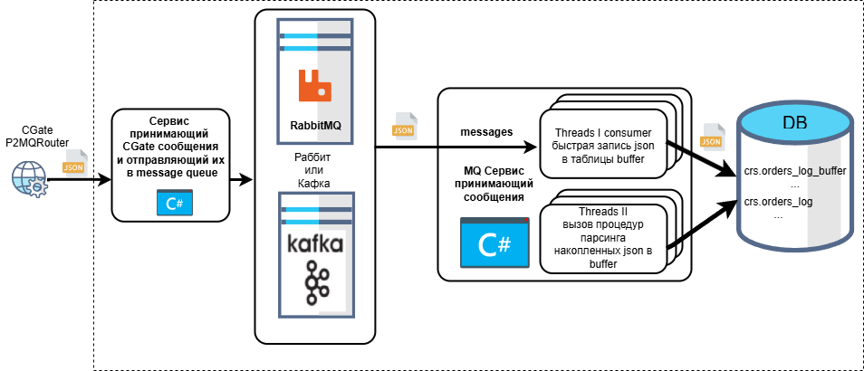
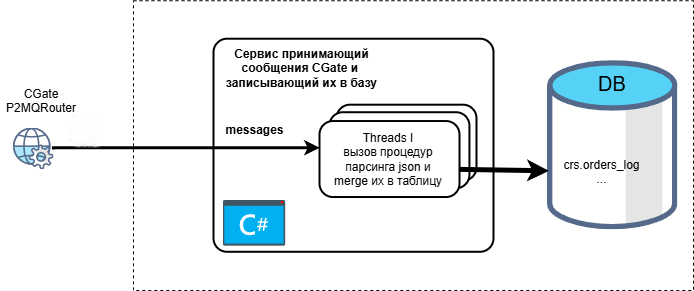
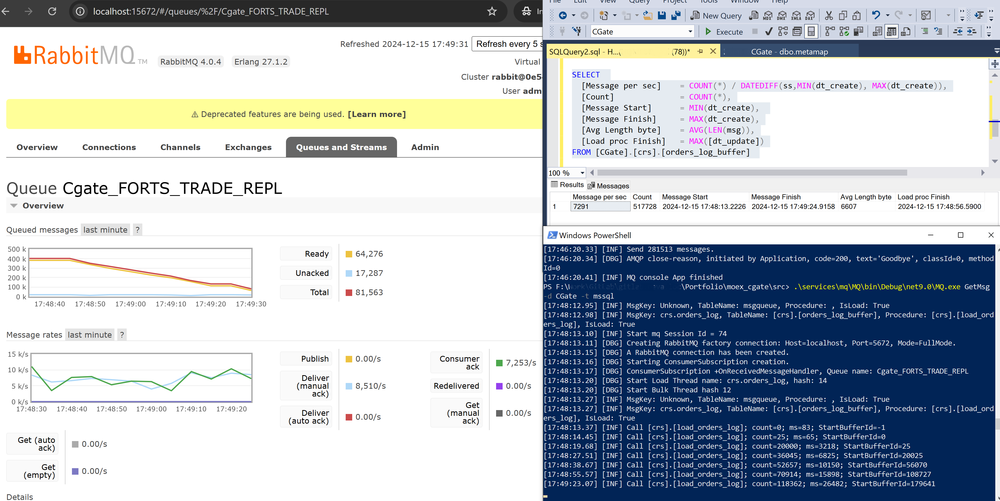
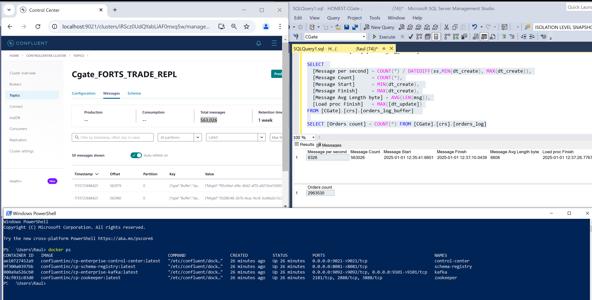

# Moex_CGate

## Увеличение скорости сохранения ордеров в базе MS-SQL, поступающих с Московской биржи по CGate. Поток FORTS_TRADE_REPL SPECTRA730 таблица order_log от 2024-11-28. 7000 ордеров в секунду (50 **Mb**).

Архитектура проекта представляет из себя многопоточное пакетное сохранение ордеров с промежуточным MessageQueue буфером. Это обеспечивает высокую скорость: 7000 сообщений по 6 Кб в секунду, гарантированную доставку и порядок поступающих ордеров в базу данных.



Если поток сообщений незначительный и скорость их записи в базу выше частоты их поступления, то вполне достаточно простой архитектуры:



Эта архитектура пишет поступившие сообщения сразу в базу в конечную таблицу ордеров. Merge 1-го сообщения составляет 1–2 секунды в зависимости от размера конечной таблицы orders_log. Это в тысячи раз медленнее, чем в многопоточной архитектуре, в которой делается INSERT в BUFFER за 0.29 ms (пакетно 0.1 ms), а Merge выполняется отложенно и, что самое главное, не по одной записи, а пакетно по всем пришедшим за секунду и уже не влияет на общую скорость получения сообщений, которая происходит параллельно, не блокируя таблицу.

Если детальнее рассмотреть процесс, то:

- Запись в RabbitMQ 500 000 сообщений составляет 20 секунд.
- Если использовать Message Queue (RabbitMQ или Kafka), то в случае отказа сервиса нет необходимости выгружать ордера с начала дня, а скорость записи в базу повышается в тысячи раз за счёт разделения записи на 2 независимых потока:
  - 1-й поток пишет максимально быстро неразобранные сообщения в буферную таблицу `orders_log_buffer`.
  - 2-й поток вызывает раз в секунду процедуру записи накопившихся сообщений в буфере, и весь пакет ордеров мержит в конечную таблицу `orders_log` по ключу `private_order_id`.

Эти 2 потока не блокируют друг друга в SNAPSHOT isolation level. Наполнение буфера и перенос из него ордеров в целевую таблицу происходят параллельно. Скорость обработки снизится всего в 1.5 раза при использовании других isolation level.

Количество загружаемых таблиц настраивается в таблице `metamap`; тестировал на 100+ параллельно загружаемых таблиц.

Пример замера производительности: загрузка 517728 сообщений средней длины 6607 байт из RabbitMQ:



Из примера видно, что загрузка в буферную таблицу `orders_log_buffer` происходила со скоростью 7291 сообщений в секунду, параллельно запускалась процедура загрузки в конечную таблицу `orders_log`, которая успела смержить 179641 сообщений и вызовы которой завершились через минуту. В итоге из тестовых сообщений было загружено 2 раза 2963530 ордеров менее чем за 2 минуты на машине i9 с накопителем M.2 NVMe Samsung 970 EVO Plus.

Kafka, настроенная как RabbitMQ в 1 partition с подтверждением сообщений (Acknowledge), работает чуть медленнее.

- Запись в Kafka 500 000 сообщений составляет 60 секунд.



Загрузка в буферную таблицу `orders_log_buffer` происходила со скоростью 6326 сообщений в секунду, параллельно запускалась процедура загрузки в конечную таблицу `orders_log`, которая загрузила 2 раза 2963530 ордеров менее чем за 2 минуты: с 12:35:41.6601 по 12:37:26.7767.

## CLR, отправляющий сообщения в RabbitMQ

Добавил 3 типа логирования: локальная таблица, Linked Server таблица и Post в очередь Rabbit. Вызовы CLR-процедур для Rabbit.Client 4.5 соизмеримы с INSERT в локальную таблицу. 100 INSERT = 29.51 ms против 100 Push = 38.68 ms — они тратят CPU сервера, а не HDD, и при определённой конфигурации и нагрузке могут быть более выгодны; отправка логов в RabbitMQ однозначно быстрее примерно в 2 раза, чем INSERT через linked server. Замер делал на 400000 вызовах по 100 операций логирования.

[Benchmark test HTML](./doc/TestPerformance.AuditParserBenchmarks-report.html)

| Method               |   Mean   |    StdDev |
| :------------------- | :-------: | --------: |
| LogLocalTable        | 29.51 ms | 1.425 ms |
| LogLinkedServerTable | 84.58 ms | 0.605 ms |
| LogRabbitMQPost      | 38.68 ms | 0.779 ms |

## [Протоколы передачи финансовых данных. Инструкция по применению](https://habr.com/ru/companies/moex/articles/261369/)

Библиотека P2 CGate представляет собой набор следующих компонент:

- системные библиотеки Plaza-2
- маршрутизатор сообщений P2MQRouter
- шлюзовая библиотека cgate
- заголовочный файл с описанием API — cgate.h

Все эти компоненты необходимы для разработки с использованием библиотеки P2 CGate и находятся в свободном доступе на [ftp.moex.com](https://ftp.moex.com/pub/ClientsAPI/Spectra/CGate).

## Prerequisites

- Windows 10+
- [Docker](https://www.docker.com/)
- [Docker Compose](https://docs.docker.com/compose/install/)
- PowerShell в режиме администратора:

```powershell
Set-ExecutionPolicy -ExecutionPolicy RemoteSigned -Scope LocalMachine
```

- MS SQL Server 2022 и Visual Studio Community 2022
- PowerShell-модуль для деплоя БД:

```powershell
Install-Module VSSetup -Scope AllUsers
```

## Getting started

> Команды CLI, `start.ps1` и `docker-compose` выполняются из каталога **`src/`**:
>
> ```powershell
> cd src
> ```

### Запуск RabbitMQ, MQ WebService и деплоя базы на локальный MSSQL

```powershell
./start.ps1
```

### MQ CLI — работа с очередью и базой

Сборка консоли:

```powershell
dotnet build .\services\mq\MQ\MQ.csproj -c Release
```

Настройки RabbitMQ и SQL берутся из `services\mq\MQ\appsettings.json`; параметры `-s`, `-d`, `-u`, `-w` переопределяют подключение к БД.

| Команда | Направление | Описание |
|---------|-------------|----------|
| `SendMsg` | SQL → RabbitMQ | Читает `msgqueue` и публикует в очередь |
| `CopyMsg` | RabbitMQ → SQL | Копирует сообщения из очереди в указанную таблицу |
| `GetMsg` | RabbitMQ → SQL | Непрерывный consumer с ETL (режим сервиса) |

**Отправка тестовых сообщений из БД в RabbitMQ:**

```powershell
.\services\mq\MQ\bin\Release\net10.0\MQ.exe SendMsg -d CGate -t mssql
```

**Копирование сообщений из RabbitMQ в buffer-таблицу SQL (например `dbo.Upload` → `dbo.Upload_buffer`):**

```powershell
.\services\mq\MQ\bin\Release\net10.0\MQ.exe CopyMsg -d CGate -t mssql -q dbo.Upload
```

Таблица создаётся автоматически, если её нет (схема buffer: `buffer_id`, `session_id`, `msg_key`, `msg_id`, `msg`, `msgtype_id`, `is_error`, `dt_create`, `dt_update`).

С явным указанием сервера и учётных данных:

```powershell
.\services\mq\MQ\bin\Release\net10.0\MQ.exe CopyMsg -t mssql -s "localhost,1434" -d CGate -u CGateUser -w MyPassword321 -q dbo.Upload
```

Полезные параметры `CopyMsg`:

| Параметр | Описание |
|----------|----------|
| `-q` | Базовое имя таблицы (`dbo.Upload` → `dbo.Upload_buffer`) |
| `-f` | Очистить (`TRUNCATE`) таблицу перед загрузкой |
| `-b` | Не создавать таблицу автоматически |
| `-z` | Не добавлять суффикс `_buffer` к имени |
| `-n` | Лимит сообщений (0 = пока очередь не опустеет) |
| `-g` / `--clear-queue` | Очищать очередь Rabbit: удалять сообщение после записи (`true`/`false`, по умолчанию `true`) |
| `-r` / `--ack` | То же, что `-g` (устаревший алиас) |
| `-e` | Запустить ETL после копирования |
| `-m` | `MetaAdapterId` для маршрутизации через `metamap` |
| `-x` | Без `metamap`, писать в `msgqueue` |

Примеры:

```powershell
# Скопировать 1000 сообщений с очисткой таблицы перед загрузкой
.\services\mq\MQ\bin\Release\net10.0\MQ.exe CopyMsg -d CGate -t mssql -q dbo.Upload -n 1000 -f

# Копировать без удаления из RabbitMQ (сообщения останутся в очереди)
.\services\mq\MQ\bin\Release\net10.0\MQ.exe CopyMsg -d CGate -t mssql -q dbo.Upload -g false

# Точное имя таблицы без _buffer
.\services\mq\MQ\bin\Release\net10.0\MQ.exe CopyMsg -d CGate -t mssql -q dbo.Upload_buffer -z

# Маршрутизация по metamap (без -q)
.\services\mq\MQ\bin\Release\net10.0\MQ.exe CopyMsg -d CGate -t mssql -m 1
```

**Непрерывный приём сообщений (режим сервиса):**

```powershell
.\services\mq\MQ\bin\Release\net10.0\MQ.exe GetMsg -d CGate -t mssql
```

### Python — `mq-copy` (анalog `CopyMsg`)

Установка (из каталога `src/`):

```powershell
cd Tools\mq-copy
python -m venv .venv
.\.venv\Scripts\Activate.ps1
pip install -e .
```

Конфиг **`copy-config.json`** уже в репозитории (тестовые пароли Docker). При необходимости: `copy copy-config.example.json copy-config.json`.

Настройки RabbitMQ и SQL — в **`Tools\mq-copy\copy-config.json`** (шаблон: `copy-config.example.json`):

| Секция JSON | Поля | Назначение |
|-------------|------|------------|
| `rabbitmq` | `host`, `port`, `virtual_host`, `username`, `password`, `queue` | Подключение к RabbitMQ |
| `database` | `server`, `database`, `user`, `password`, `driver` | MS SQL Server (ODBC) |
| `copy` | `target_table`, `truncate_before_copy`, … | Параметры копирования |

Параметры CLI **перекрывают** JSON. Пароль Rabbit можно передать из командной строки: **`--rabbit-password`**.

**Копирование RabbitMQ → `dbo.Upload_buffer`:**

```powershell
cd Tools\mq-copy
python -m mq_copy -c copy-config.json --rabbit-password admin -q dbo.Upload
```

Примеры:

```powershell
# Все подключения из CLI (без copy-config.json)
python -m mq_copy `
  --rabbit-host localhost --rabbit-user admin --rabbit-password admin `
  --rabbit-queue Cgate_FORTS_TRADE_REPL `
  -s "localhost,54321" -d CGate -u CGateUser -w MyPassword321 `
  -q dbo.Upload

# Очистить таблицу перед загрузкой
python -m mq_copy -c copy-config.json --rabbit-password admin -q dbo.Upload -f true

# Лимит 1000 сообщений
python -m mq_copy -c copy-config.json --rabbit-password admin -q dbo.Upload -n 1000
```

| Параметр | Описание |
|----------|----------|
| `-c` | Путь к JSON-конфигу |
| `--rabbit-host`, `--rabbit-port`, `--rabbit-user`, `--rabbit-password`, `--rabbit-queue` | RabbitMQ |
| `-s`, `-d`, `-u`, `-w` | SQL Server (как в `MQ.exe`) |
| `-q` | Базовое имя таблицы (`dbo.Upload` → `dbo.Upload_buffer`) |
| `-f true` | `TRUNCATE` перед копированием |
| `-n` | Лимит сообщений |
| `-g` / `--clear-queue true/false` | Очищать очередь Rabbit после записи (по умолчанию `true`) |
| `-r` / `--ack` | Алиас для `-g` |
| `-b` | Не создавать buffer-таблицу |
| `-z` | Не добавлять суффикс `_buffer` |

Подробнее: [`src/Tools/mq-copy/README.md`](./src/Tools/mq-copy/README.md).

### Debug в Visual Studio 2022

```powershell
docker-compose -f docker-compose.rabbit.yml up
```

Затем запустить `services\mq\MQ.sln`.

### Docker SQL (ветка Basic)

В текущей ветке контейнер MSSQL Linux недоступен — MSSQL Linux запрещает создавать UNSAFE CLR. Для Docker SQL используйте ветку **Basic**.

```powershell
./start.ps1 -IsDockerSql $true
```

В другом окне PowerShell:

```powershell
# Перезапуск MQ WebService
Invoke-RestMethod -Method Post -Uri http://localhost:8090/v1/mq/service/reset

# Отправка сообщений DB → RabbitMQ
.\services\mq\MQ\bin\Release\net10.0\MQ.exe SendMsg -t mssql -s "localhost,1434" -d CGate -u CGateUser -w MyPassword321 -i 10 -a 500

# Копирование RabbitMQ → SQL (C#)
.\services\mq\MQ\bin\Release\net10.0\MQ.exe CopyMsg -t mssql -s "localhost,1434" -d CGate -u CGateUser -w MyPassword321 -q dbo.Upload

# Копирование RabbitMQ → SQL (Python)
cd Tools\mq-copy
python -m mq_copy -c copy-config.json --rabbit-password admin -q dbo.Upload
```

### Подключение в SSMS

- server: `localhost,1434`
- user: `CGateUser`
- password: `MyPassword321`

### REST API MQ WebService

| Действие | Метод | URL |
|----------|-------|-----|
| Старт | POST | `http://localhost:8090/v1/mq/service/start` |
| Стоп | POST | `http://localhost:8090/v1/mq/service/stop` |
| Reset | POST | `http://localhost:8090/v1/mq/service/reset` |
| Статус | GET | `http://localhost:8090/v1/mq/service/status` |
| Health | GET | `http://localhost:8090/v1/mq/health` |

Swagger UI: [http://localhost:8090/swagger/index.html](http://localhost:8090/swagger/index.html)

### Мониторинг

- RabbitMQ: [http://localhost:15672/](http://localhost:15672/) — user: `admin`, password: `admin`
- Kafka UI: [http://localhost:9021/](http://localhost:9021/)
