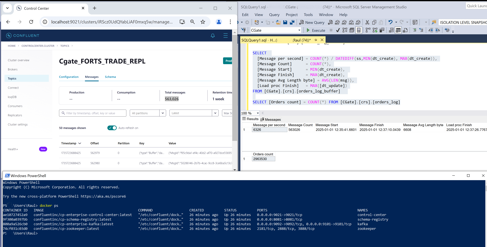

# Moex_CGate

## Увеличение скорости сохранения ордеров в базе MSSQL, поступающих с Московской биржи по CGate. Поток FORTS_TRADE_REPL SPECTRA730 таблица order_log от 2024-11-28. 7к ордеров в секунду.

Архитектура проекта представляет из себя многопоточное пакетное сохранение ордеров с промежуточным MessageQueue буфером. Это обеспечивает гарантированную доставку и порядок поступающих ордеров в базу данных.


Если поток сообщений незначительный и скорость их записи в базу выше частоты их поступления, то вполне достаточно простой архитектуры:


Эта архитектура пишет поступившие сообщения сразу в базу в конечную таблицу ордеров. Запись 1го сообщения составляет 1-2 секунды в зависимости от размера target таблицы orders_log.

Для сравнения:

- Запись в RabbitMQ 500 000 сообщений составляет 20 секунд,
- Если использовать Message queue(RabbitMQ или Kafka) то в случае отказа сервиса нет необходимости выгружать ордера с начала дня, а скорость записи в базу повышается в десятки раз за счет разделения записи на 2 независымых потока:

  - 1й поток пишет максимально быстро неразобранные сообщения в буферную таблицу orders_log_buffer.
  - 2й поток вызывает раз в секунду процедуру записи накопившихся сообщений в буфере и весь пакет ордеров мержит в конечную таблицу orders_log по ключу private_order_id.

Эти 2 потока не блокируют друг друга в SNAPSHOT isolation level. Наполнение буфера и перенос из него ордеров в таргет таблицу происходят паралельно. Скорость обработки снизится всего в 1.5 раза при использовании других isolation level.

Количество загружаемых таблиц настраивается в таблице metamap, тестировал на 100+ паралельно загружаемых таблиц.

Пример замера производительности: Загрузка 517728 сообщений средней длинной 6607 байт из RabbitMQ:

Из примера видно, что загрузка в буферную таблицу orders_log_buffer происходила со скоростью 7291 сообщений в секунду, паралельно запускалась процедура загрузки в конечную таблицу orders_log, которая успела смержить 179641 сообщений и вызовы которой завершились через минуту. В итоге из тестовых сообщений было загружено 2 раза 2963530 ордеров менее чем за 2 минуты,
на старенькой машине I9 с накопителем M.2 NVMe Samsung 970 EVO Plus.

Кафка, настроенная как RabbitMQ в 1 partition c подтверждением сообщений(Acknowledge), работает чуть медленнее.
Запись в Кафка 500 000 сообщений составляет 60 секунд,

Загрузка в буферную таблицу orders_log_buffer происходила со скоростью 6326 сообщений в секунду, паралельно запускалась процедура загрузки в конечную таблицу orders_log, которая загрузила 2 раза 2963530 ордеров менее чем за 2 минуты: с 12:35:41.6601 по 12:37:26.7767.

## [Протоколы передачи финансовых данных. Инструкция по применению](https://habr.com/ru/companies/moex/articles/261369/)

 Библиотека P2 CGate представляет собой набор следующих компонент:

- системные библиотеки Plaza-2
- маршрутизатор сообщений P2MQRouter
- шлюзовая библиотека cgate
- заголовочный файл с описанием API - cgate.h

 Все эти компоненты необходимы для разработки с использованием библиотеки P2 CGate
 и находятся в свободном доступе на [ftp.moex.com](https://ftp.moex.com/pub/ClientsAPI/Spectra/CGate)

## Prerequisites

- On Windows 10
- Install [Docker](https://www.docker.com/)
- Install [Docker Compose](https://docs.docker.com/compose/install/)
- Setup powershell in admin mode

```
Set-ExecutionPolicy -ExecutionPolicy RemoteSigned -Scope LocalMachine
```

- Install  MS SQL Server 2022 and Visual Studio Community 2022
- Install powershell Visual Studio library for deployment script MSqlDeploymentFunc.psm1

```
Install-Module VSSetup -Scope AllUsers
```

## Getting started

Запуск RabbitMQ, MQService, деплоя базы на локальный MSSQL server:

```
./start.ps1
```

Отправка в RabbitMQ тестовых сообщений:

```
.\services\mq\MQ\bin\Release\net9.0\MQ.exe SendMsg -d CGate -t mssql
```

Debug in Visual Studio 2022:

```
docker-compose -f docker-compose.rabbit.yml up
and start MQ.sln
```

В случае отсутствия локальноного MSSQL можно запустить sql в контейнере.

```
./start.ps1 -IsDockerSql $true
```

В другом powershell окне запустить:

```
#Reset MQ service:
Invoke-RestMethod -Uri http://localhost:8090/api/Home/reset
#Отправку сообщений:
.\services\mq\MQ\bin\Release\net9.0\MQ.exe SendMsg -t mssql -s "localhost,1434" -d CGate -u CGateUser -w MyPassword321 -i 10 -a 500
```

Подключение в ssms:

- server: localhost,1434
- user: CGateUser
- password: MyPassword321

Рестарт и проверка статуса сервиса MQ:
http://localhost:8090/swagger/index.html

Rabbit: http://localhost:15672/
Kafka:  http://localhost:9021/
