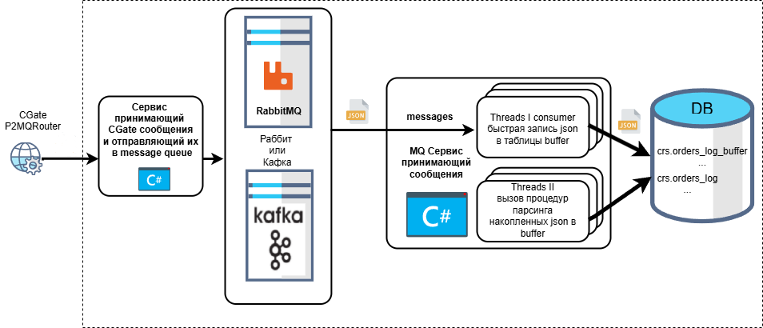

# Moex_CGate

## Оптимизация сохранения ордеров в базе, поступающих с Московской биржи по CGate

Архитектура проекта представляет из себя многопоточное пакетное сохранение ордеров с промежуточным MessageQueue буфером. Это обеспечивает гарантированную доставку и порядок поступающих ордеров в базу данных.

Если поток сообщений маленький и скорость их записи в базу выше частоты их поступления, то достаточно простой архитектуры:


Эта архитектура пишет поступившие сообщения сразу в базу в конечную таблицу ордеров. Запись 1го сообщения составляет 1-2 секунды в зависимости от размера таблицы.

Для сравнения:

- Запись в RabbitMQ 500 000 сообщений составляет 20 секунд,
- Если использовать Message queue(RabbitMQ или Kafka) то скорость записи в базу повышается в десятки раз за счет разделения записи на 2 независымых потока:

  - 1й поток пишет максимально быстро неразобранные сообщения в буферную таблицу.
  - 2й поток вызывает раз в секунду процедуру записи накопившихся сообщений в буфере и весь пакет ордеров мержит в конечную таблицу.

Эти 2 потока не блокируют друг друга. Наполнение буфера и перенос из него ордеров в таргет таблицу происходят паралельно.

Сервис создает таких пар потоков скольугодно много.  Количество потоков зависит от того, на какие источники CGate подписан сервис.

## [Протоколы передачи финансовых данных. Инструкция по применению](https://habr.com/ru/companies/moex/articles/261369/)

 Библиотека P2 CGate представляет собой набор следующих компонент:

- системные библиотеки Plaza-2
- маршрутизатор сообщений P2MQRouter
- шлюзовая библиотека cgate
- заголовочный файл с описанием API - cgate.h

 Все эти компоненты необходимы для разработки с использованием библиотеки P2 CGate
 и находятся в свободном доступе на [ftp.moex.com](https://ftp.moex.com/pub/ClientsAPI/Spectra/CGate)

## Prerequisites

- On Windows 10
- Install [Docker](https://www.docker.com/)
- Install [Docker Compose](https://docs.docker.com/compose/install/)
- Setup powershell in admin mode

```
Set-ExecutionPolicy -ExecutionPolicy RemoteSigned -Scope AllUsers
```

- Install  MS SQL Server 2022 and Visual Studio Community 2022
- Install powershell Visual Studio library for deployment script MSqlDeploymentFunc.psm1

```
Install-Module VSSetup -Scope AllUsers
```

## Getting started

Запуск RabbitMQ, MQService, деплоя базы на локальный MSSQL server:

```
./start.ps1
```

Отправка в RabbitMQ тестовых сообщений:

```
.\services\mq\MQ\bin\Release\net9.0\MQ.exe SendMsg -d CGate -t mssql
```

Debug in Visual Studio 2022:

```
docker-compose -f docker-compose.rabbit.yml up


and start MQ.sln
```
